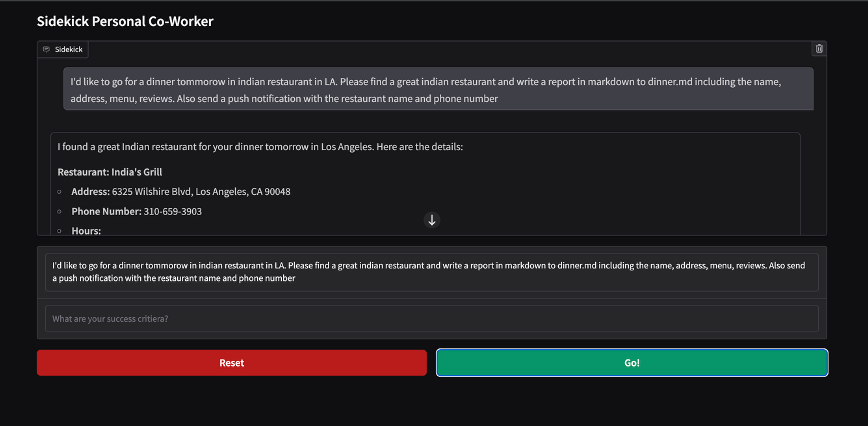

# Sidekick Personal Co-Worker 🤖

An intelligent AI assistant that automates complex tasks through web browsing, file management, and code execution. Built with LangGraph workflows, it features a built-in evaluation system that ensures tasks meet your specific success criteria before completion. Think of it as your digital coworker that can research, analyze, create reports, and send you mobile notifications when tasks are done.



## Features

- 🌐 Web browsing with Playwright
- 🔍 Google search/Wikipedia integration  
- 📝 File operations in sandboxed environment
- 🐍 Python code execution
- 📱 Push notifications on mobile
- 🧠 Success criteria evaluation loop

## Quick Setup

### 1. Install uv (if not installed)
```bash
# macOS/Linux
curl -LsSf https://astral.sh/uv/install.sh | sh

# Windows
powershell -c "irm https://astral.sh/uv/install.ps1 | iex"

# Or via pip
pip install uv
```

### 2. Clone and Setup Project
```bash
git clone https://github.com/ShivamPatel-India/Sidekick-AI-coworker.git
cd Sidekick-AI-coworker
uv venv
source .venv/bin/activate  # Windows: .venv\Scripts\activate
uv sync
uv run playwright install
```

### 3. Environment Setup
Create `.env` file:
```env
OPENAI_API_KEY=sk-your-key-here
SERPER_API_KEY=your-serper-key  # for google search
PUSHOVER_TOKEN=your-token       # for mobile notification
PUSHOVER_USER=your-user         # for mobile notification
```

### 4. Run
```bash
uv run app.py
```

Opens at `http://127.0.0.1:7864`

## Usage

1. Enter request: *"Find a good Italian restaurant in NYC"*
2. Set success criteria: *"Include address, phone, hours, reviews"* (optional) 
3. Click **Go!**
4. Get validated results

## API Keys

- **OpenAI**: [platform.openai.com](https://platform.openai.com/api-keys)
- **Serper**: [serper.dev](https://serper.dev/) (optional, for web search)
- **Pushover**: [pushover.net](https://pushover.net/) (optional, for notifications)

## Troubleshooting

```bash
# Dependencies issue
uv sync

# Browser issue  
uv run playwright install

# Port conflict
# Modify app.py: ui.launch(server_port=8080)

# Virtual environment activation
source .venv/bin/activate  # or .venv\Scripts\activate on Windows
```

Built with LangGraph, LangChain, Gradio, Playwright, and OpenAI.